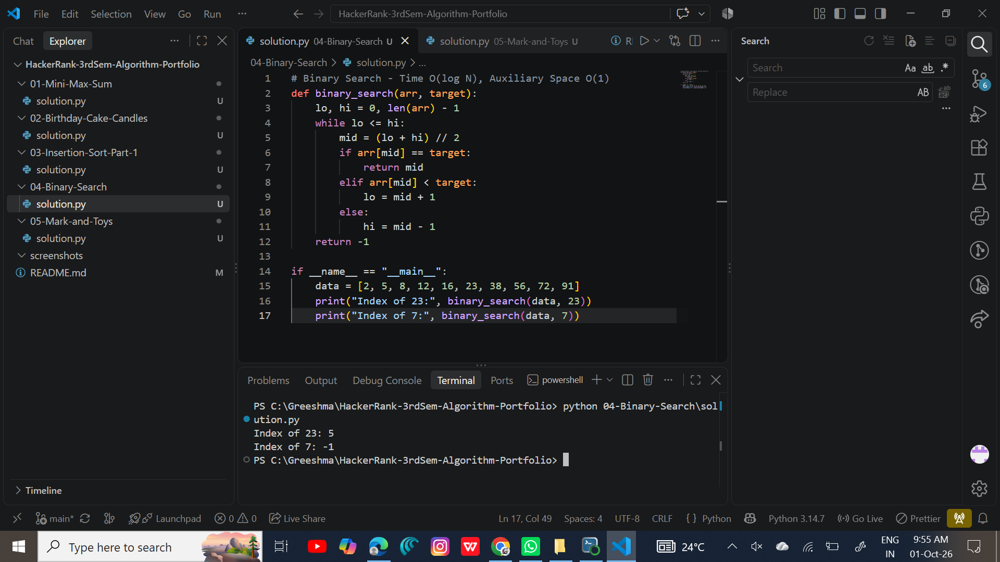

# HackerRank-3rdSem-Algorithm-Portfolio# HackerRank 3rd Sem Algorithm Portfolio

**Name:** Greeshma V | **SRN:** R25EF092 | **Semester:** III (B.Tech CSE)
**HackerRank:** https://www.hackerrank.com/profile/greeshmav196
**GitHub Repo:** https://github.com/Greeshma-88/HackerRank-3rdSem-Algorithm-Portfolio

## Introduction
This portfolio contains my solutions to five algorithm problems in Python,
with complexity analysis, alternative approaches and evidence of accepted submissions.

## Summary Table
| # | Problem | Technique | Time | Aux. Space | Status |
|---|---------|-----------|------|------------|--------|
| 1 | Mini-Max Sum | Min/max tracking | O(N) | O(1) | Accepted |
| 2 | Birthday Cake Candles | Max + count | O(N) | O(1) | Accepted |
| 3 | Insertion Sort - Part 1 | Element shifting | O(N) | O(1) | Accepted |
| 4 | Binary Search | Divide and conquer | O(log N) | O(1) | Tested |
| 5 | Mark and Toys | Greedy + sorting | O(N log N) | O(N)* | Accepted |

*Python's Timsort needs up to O(N) auxiliary space in the worst case.

## 1. Mini-Max Sum
[Challenge](https://www.hackerrank.com/challenges/mini-max-sum) | [Solution](01-Mini-Max-Sum/solution.py) | 
- **Problem:** Given 5 integers, print the minimum and maximum sums of any 4 of them.
- **Approach:** Compute total sum once; minimum sum = total - max, maximum sum = total - min.
- **Complexity:** Time O(N), auxiliary space O(1).
- **Alternative:** Sort the array and sum the first/last four: O(N log N), slower.
- **Why efficient:** Only linear passes, no sorting needed.

## 2. Birthday Cake Candles
[Challenge](https://www.hackerrank.com/challenges/birthday-cake-candles) | [Solution](02-Birthday-Cake-Candles/solution.py) | 
- **Problem:** Count how many candles have the maximum height.
- **Approach:** Find the maximum, then count its occurrences.
- **Complexity:** Time O(N) (two linear passes), auxiliary space O(1).
- **Alternative:** Single pass keeping a running max and count; or a frequency dictionary (O(N) space).
- **Why efficient:** Linear time is optimal since every element must be inspected.

## 3. Insertion Sort - Part 1
[Challenge](https://www.hackerrank.com/challenges/insertionsort1) | [Solution](03-Insertion-Sort-Part-1/solution.py) | 
- **Problem:** Insert the last element into an otherwise sorted array, printing after each shift.
- **Approach:** Store the last value, shift larger elements right one step at a time, then place the value.
- **Complexity:** Time O(N), auxiliary space O(1).
- **Alternative:** Find the position with binary search, then shift; still O(N) because of shifting.
- **Why efficient:** Works in place with a single backward scan.

## 4. Binary Search
[Solution](04-Binary-Search/solution.py) | 
- **Problem:** Find a target in a sorted array.
- **Approach:** Repeatedly halve the search range by comparing with the middle element.
- **Complexity:** Time O(log N), auxiliary space O(1) (iterative).
- **Alternative:** Recursive version uses O(log N) stack space; linear search is O(N).
- **Why efficient:** Each step discards half the remaining elements.

## 5. Mark and Toys
[Challenge](https://www.hackerrank.com/challenges/mark-and-toys) | [Solution](05-Mark-and-Toys/solution.py) | 
- **Problem:** Maximise the number of toys bought within a budget k.
- **Approach (greedy):** Sort prices ascending and buy the cheapest first until money runs out.
- **Complexity:** Time O(N log N) from sorting, auxiliary space O(1) for the loop (Timsort may use O(N)).
- **Alternative:** Min-heap, popping cheapest items: O(N + K log N).
- **Why efficient:** Cheapest-first is provably optimal for maximising item count.

## Badge Evidence
